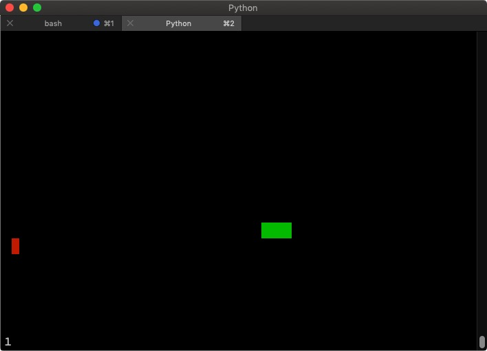

# Snake

Snake written in Python using ncurses.



## Features

Everything a snake game has to have ;)

Use ```snake.py``` with python3.

## Attribution

The original code is from @engineer-man (https://github.com/engineer-man/youtube/blob/master/015/snake.py). 
I added comments, cleaned it up and added some features.